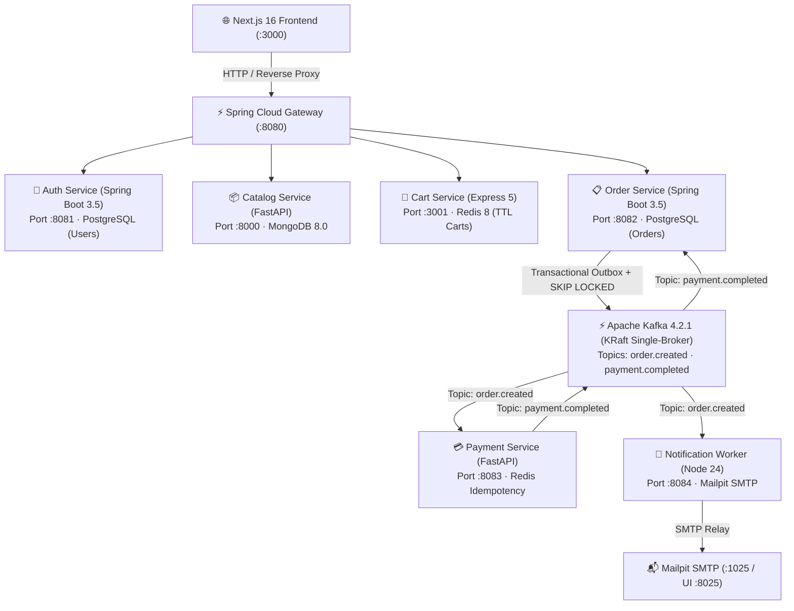

# Nexora Cloud Commerce — Polyglot Microservices Platform

[](./docker-compose.yml)
[-black?logo=apachekafka)](https://kafka.apache.org/)
[](https://spring.io/projects/spring-boot)
[](https://fastapi.tiangolo.com/)
[](https://expressjs.com/)
[](https://nextjs.org/)
[](https://www.postgresql.org/)
[](https://www.mongodb.com/)
[](https://redis.io/)

A production-grade, enterprise polyglot e-commerce platform built as 8 independently containerizable microservices communicating through a **Spring Cloud Gateway** and an **Apache Kafka 4.2 KRaft event bus** over **PostgreSQL 18**, **MongoDB 8.0**, and **Redis 8**, with a reactive **Next.js 16** frontend animated via **Anime.js**.

---

## 🏛️ System Architecture & Service Topology



---

## 🚀 Microservices Roster

| Service | Runtime / Framework | Internal Port | Datastore / Broker | Key Responsibilities |
| :--- | :--- | :--- | :--- | :--- |
| **`api-gateway`** | Java 21 · Spring Cloud Gateway 4.3 | `8080` (public) | Redis 8 | Central reverse proxy, JWT bearer verification, route security, Redis request rate limiting, `/actuator/health/readiness` probes. |
| **`auth-service`** | Java 21 · Spring Boot 3.5 | `8081` | PostgreSQL 18 (`users`) | User registration, bcrypt authentication, signed HS256 JWT minting, `/auth/me` profile resolution, Flyway migrations. |
| **`catalog-service`** | Python 3.13 · FastAPI 0.141 | `8000` | MongoDB 8.0 (`products`) | Product catalog CRUD, faceted search, category filtering, PyMongo AsyncClient engine. |
| **`cart-service`** | Node.js 24 · Express 5.2 | `3001` | Redis 8 (`cart:{userId}`) | Ephemeral cart state, unit price validation against catalog, automatic 24-hour TTL sliding expiration. |
| **`order-service`** | Java 21 · Spring Boot 3.5 | `8082` | PostgreSQL 18 (`orders`) | Order creation, Transactional Outbox pattern with `SELECT ... FOR UPDATE SKIP LOCKED`, Kafka event producer/consumer, payment saga state machine (`PENDING_PAYMENT` ➔ `PAID` / `PAYMENT_FAILED`), automated reconciliation sweep. |
| **`payment-service`** | Python 3.13 · FastAPI 0.141 | `8083` | Redis 8 (Dedup) | Async Kafka consumer (`aiokafka`), mock authorization, post-produce 1-hour TTL Redis idempotency guard. |
| **`notification-service`** | Node.js 24 · kafkajs | `8084` | Mailpit Mock SMTP | Async Kafka consumer for `order.created` and `payment.completed`, responsive email dispatch via Nodemailer, real-time HTTP `/health` probe. |
| **`frontend`** | Node.js 24 · Next.js 16.3 | `3000` (public) | Browser / Gateway API | Responsive marketplace UI, Anime.js animation engine, Live Telemetry drawer, AI product comparator, price watcher, perks vault. |

---

## ✨ Architectural Features & Patterns

### 1. Dual-Write Elimination via Transactional Outbox & Row-Locking
- Order creation and its companion `order.created` event are committed atomically to PostgreSQL within the same database transaction.
- An `@Scheduled` `OutboxRelay` claims pending events using **`SELECT ... FOR UPDATE SKIP LOCKED`** and publishes them to Kafka. This guarantees zero duplicate publishing or race conditions when scaling `order-service` across multiple Kubernetes pod replicas.

### 2. At-Least-Once Kafka Saga Choreography
- Distributed order-payment saga coordinates asynchronously over Kafka topics without distributed two-phase commits.
- Deduplication and idempotency keys in `payment-service` and `order-service` ensure safe redeliveries and crash recovery.

### 3. Multi-Model Polyglot Persistence
- **Relational Data (PostgreSQL 18):** ACID guarantees for user authentication records, order snapshots, and outbox queues.
- **Document Store (MongoDB 8.0):** Flexible JSON schema for dynamic product specifications, ratings, and categories.
- **In-Memory Datastore (Redis 8):** Ultra-low latency shopping carts with auto-eviction TTLs and distributed rate limiting.

### 4. Zero-ZooKeeper KRaft Architecture
- Apache Kafka 4.2.1 operates natively in **KRaft** mode (combined broker & controller), eliminating external ZooKeeper dependencies and simplifying container orchestration.

### 5. Kubernetes Readiness & Health Probes
- All Spring Boot services expose dedicated **`/actuator/health/liveness`** and **`/actuator/health/readiness`** endpoints configured with `management.endpoint.health.probes.enabled: true`.
- `notification-service` exposes a real HTTP **`/health`** probe verifying live Kafka consumer connection events (`CONNECT`, `DISCONNECT`, `CRASH`).
- Frontend API Gateway URL is dynamically driven via **`API_GATEWAY_URL`** environment variable for seamless Helm / ConfigMap injection.

---

## 🛠️ Quick Start

### Prerequisites
- [Docker](https://docs.docker.com/get-docker/) & Docker Compose v2 (e.g. Docker Desktop)
- Windows PowerShell, macOS zsh, or Linux bash

### 1. Clone & Configure Environment
```bash
git clone https://github.com/Shashidhar-Pawadashetti/Ecommerce-Microservices-Platform.git
cd Ecommerce-Microservices-Platform

# Copy environment variable template
cp .env.example .env
```

### 2. Launch the Microservices Fleet
```bash
docker compose up -d
```

### 3. Verify Container Health
```bash
docker compose ps
```
All 14 containers (7 application microservices, 3 datastores, Kafka, Kafka UI, Mailpit, and frontend) should report `(healthy)` or `(Up)`.

---

## 🌐 Platform Port Map

| Component | Host URL | Description |
| :--- | :--- | :--- |
| **Marketplace Web App** | [http://localhost:3000](http://localhost:3000) | Nexora Cloud Commerce Next.js Frontend |
| **Spring Cloud API Gateway** | [http://localhost:8080](http://localhost:8080) | Public REST Gateway & JWT Router |
| **Kafka UI Dashboard** | [http://localhost:8088](http://localhost:8088) | Topic viewer, partition monitor, and consumer group inspector |
| **Mailpit Web Mail UI** | [http://localhost:8025](http://localhost:8025) | Interactive mock email inbox for purchase confirmations |
| **Mailpit SMTP Relay** | `localhost:1025` | Internal mock SMTP socket |
| **Kafka Broker** | `localhost:9092` | PLAINTEXT Kafka KRaft broker |

---

## 🧪 End-to-End Purchase Saga Verification

Run this automated PowerShell script to execute the complete end-to-end journey across all 7 microservices:

```powershell
# 1. Register and Login
$email = "shopper_" + (Get-Random) + "@example.com"
$pwd = "NexoraPass2026!"
$signup = Invoke-RestMethod -Uri "http://localhost:8080/auth/signup" -Method Post -ContentType "application/json" -Body (@{ email = $email; password = $pwd } | ConvertTo-Json)
$login = Invoke-RestMethod -Uri "http://localhost:8080/auth/login" -Method Post -ContentType "application/json" -Body (@{ email = $email; password = $pwd } | ConvertTo-Json)
$token = $login.accessToken
$headers = @{ Authorization = "Bearer $token" }

# 2. Browse Catalog & Add Item to Cart
$catalog = Invoke-RestMethod -Uri "http://localhost:8080/catalog/products" -Method Get
$item = $catalog.items[0]
$cart = Invoke-RestMethod -Uri "http://localhost:8080/cart/items" -Method Post -Headers $headers -ContentType "application/json" -Body (@{ productId = $item.id; quantity = 1 } | ConvertTo-Json)

# 3. Checkout (Outbox Transaction)
$orderHeaders = @{ Authorization = "Bearer $token"; "Idempotency-Key" = [System.Guid]::NewGuid().ToString() }
$order = Invoke-RestMethod -Uri "http://localhost:8080/orders" -Method Post -Headers $orderHeaders -ContentType "application/json" -Body "{}"
Write-Host "Order Created: $($order.orderId) (Status: $($order.status))"

# 4. Wait for Kafka Saga Settlement
Start-Sleep -Seconds 3
$finalOrder = Invoke-RestMethod -Uri "http://localhost:8080/orders/$($order.orderId)" -Method Get -Headers $headers
Write-Host "Settled Order Status: $($finalOrder.status)" # Output: PAID

# 5. Verify Confirmation Email Delivery in Mailpit
$emails = Invoke-RestMethod -Uri "http://localhost:8025/api/v1/messages" -Method Get
Write-Host "Latest Delivered Email: $($emails.messages[0].Subject)"
```

---

## 📂 Repository Layout

```
├── docs/                       # OpenAPI contracts, Kafka schema documentation, and architecture specs
├── services/
│   ├── api-gateway/            # Spring Cloud Gateway 4.3 (Java 21) — Routing, Rate Limiting & Auth Filter
│   ├── auth-service/           # Spring Boot 3.5 (Java 21) — PostgreSQL Users DB, JWT Issuer & /me
│   ├── catalog-service/        # FastAPI 0.141 (Python 3.13) — MongoDB 8.0 Product Catalog & Search
│   ├── cart-service/           # Express 5.2 (Node 24) — Redis 8 Ephemeral Carts with Sliding TTL
│   ├── order-service/          # Spring Boot 3.5 (Java 21) — PostgreSQL Orders DB, Outbox Relay (SKIP LOCKED) & Saga
│   ├── payment-service/        # FastAPI 0.141 (Python 3.13) — Kafka Saga Consumer & Redis Dedup
│   ├── notification-service/   # Node.js 24 Worker — Kafka Consumer, Mailpit SMTP Dispatcher & /health HTTP
│   └── frontend/               # Next.js 16.3 (React 19, TypeScript, Anime.js, TailwindCSS)
├── docker-compose.yml          # Complete 14-container infrastructure & microservice orchestration
└── .env.example                # Contractual environment variable configuration template
```

---

## 📄 License
This project is open-source and available under the [MIT License](LICENSE).
