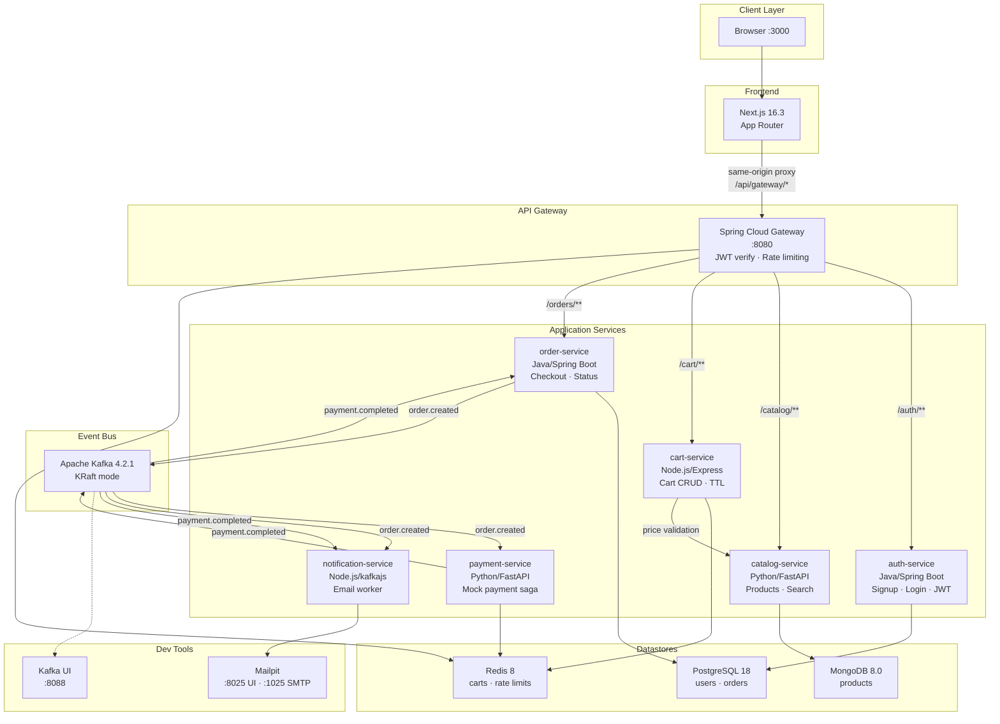
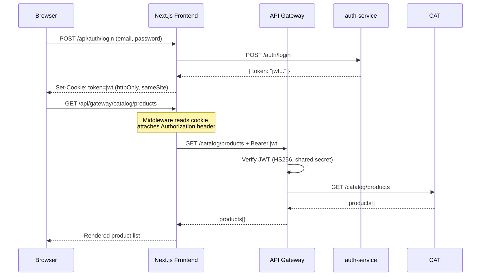

# Architecture — Ecommerce Microservices Platform

## System Overview

A polyglot e-commerce platform composed of **7 application services**, an **API gateway**, and a **Next.js frontend**, orchestrated locally via Docker Compose. Three language runtimes (Java/Spring Boot, Python/FastAPI, Node.js/Express) communicate through REST and Apache Kafka events, backed by three datastore types (PostgreSQL, MongoDB, Redis).

## Architecture Diagram



## Service Map

| Service | Language | Framework | Port | Datastore | Purpose |
|---------|----------|-----------|------|-----------|---------|
| **frontend** | TypeScript | Next.js 16.3 (App Router) | 3000 | — | Storefront UI, httpOnly cookie auth |
| **api-gateway** | Java 21 | Spring Cloud Gateway 4.3 | 8080 | Redis (rate limiting) | Single ingress, JWT enforcement, routing |
| **auth-service** | Java 21 | Spring Boot 3.5 | 8081 (internal) | PostgreSQL (users) | Signup, login, JWT issuance |
| **catalog-service** | Python 3.13 | FastAPI 0.141 | 8000 (internal) | MongoDB (products) | Product CRUD, search, seed |
| **cart-service** | Node.js 24 | Express 5 | 3001 (internal) | Redis (carts) | Cart CRUD, server-side totals |
| **order-service** | Java 21 | Spring Boot 3.5 | 8082 (internal) | PostgreSQL (orders) | Checkout, order status, Kafka producer |
| **payment-service** | Python 3.13 | FastAPI 0.141 | 8083 (internal) | Redis (dedup) | Mock payment, Kafka consumer/producer |
| **notification-service** | Node.js 24 | kafkajs worker | — | — | Email notifications via Mailpit |

## Kafka Event Flow

Two topics drive the async order→payment saga:

1. **`order.created`** (3 partitions, RF=1)
   - **Producer:** order-service (on `POST /orders` checkout)
   - **Consumers:** payment-service (saga participant), notification-service (email)
   - **Key:** `orderId` (string)
   - **Payload:** order snapshot with items, prices, userId

2. **`payment.completed`** (3 partitions, RF=1)
   - **Producer:** payment-service (after mock processing)
   - **Consumers:** order-service (status transition), notification-service (email)
   - **Key:** `orderId` (string)
   - **Payload:** `{ orderId, outcome: "APPROVED"|"DECLINED", ... }`

### State Machine

```
POST /orders → PENDING_PAYMENT
  ↓ payment.completed (APPROVED)  → PAID
  ↓ payment.completed (DECLINED)  → PAYMENT_FAILED
```

Terminal states (`PAID`, `PAYMENT_FAILED`) are idempotent — redelivery of `payment.completed` is safe.

## Authentication Flow



## Infrastructure

| Component | Image | Purpose |
|-----------|-------|---------|
| PostgreSQL 18 | `postgres:18` | users + orders databases |
| MongoDB 8.0 | `mongo:8.0` | products collection |
| Redis 8 | `redis:8-alpine` | carts, rate limiting, payment dedup |
| Apache Kafka 4.2.1 | `apache/kafka:4.2.1` | Event bus (KRaft, no ZooKeeper) |
| Mailpit | `axllent/mailpit` | Mock SMTP + web UI |
| Kafka UI | `provectuslabs/kafka-ui` | Topic/consumer inspection |

## Key Design Decisions

1. **Polyglot by design** — Three language runtimes prove the interop contracts work across technology boundaries, which is the core learning goal.
2. **Contracts-first** — OpenAPI specs and Kafka topic schemas (Phase 1) exist before any service code, serving as the sole drift guard.
3. **No ZooKeeper** — Kafka 4.x is KRaft-only; the ZK container is dead weight.
4. **Motor → PyMongo AsyncMongoClient** — Motor is deprecated (EOL 2026-05-14); native `pymongo.AsyncMongoClient` (≥4.9) is the official replacement.
5. **MailHog → Mailpit** — MailHog is unmaintained since 2020; Mailpit is drop-in compatible with REST API for assertions.
6. **Integer-cents money** — All prices are `priceCents: int` to avoid floating-point drift across three languages.
7. **httpOnly cookie JWT** — The frontend never exposes the JWT to client-side JavaScript; the Next.js server-side proxy attaches it.
